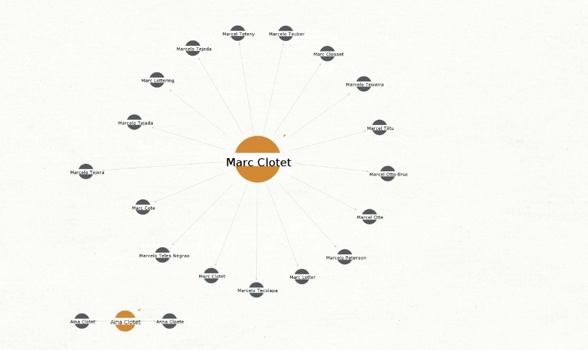

# Cybersecurity Lab Portfolio - Complete Edition

**Portfolio Date**: May 2026 | **Author**: 2512782 | **Last Updated**: 2026-05-25

---

## Table of Contents

1. [Overview](#overview)
2. [Unit 2: Footprinting & Passive Reconnaissance (OSINT)](#unit-2-footprinting--passive-reconnaissance-osint)
3. [Unit 3: Active Reconnaissance & Local Subnet Diagnostics](#unit-3-active-reconnaissance--local-subnet-diagnostics)
4. [Unit 4: Controlled Exploitation & Automated Auditing](#unit-4-controlled-exploitation--automated-auditing)
5. [Formal Laboratory Question Responses](#formal-laboratory-question-responses)

---

## Overview

This portfolio documents a comprehensive cybersecurity laboratory focused on open-source threat intelligence (OSINT), passive reconnaissance, active reconnaissance, and controlled exploitation techniques.

### Learning Objectives

- Master OSINT methodologies using automated node graph linkages (Maltego)
- Execute CLI-based DNS and network registry lookups
- Conduct subnet diagnostics and active reconnaissance
- Perform controlled vulnerability exploitation and post-exploitation analysis
- Execute automated vulnerability auditing with enterprise-grade tools

### Key Technologies

* **Reconnaissance**: Maltego, whois, dig, nmap
* **Exploitation**: Metasploit Framework, Nessus
* **Target Platforms**: Kali Linux, Ubuntu, Metasploitable
* **Analysis**: CVSS/CVE frameworks, vulnerability scoring

---

# Unit 2: Footprinting & Passive Reconnaissance (OSINT)

## Overview

This module evaluates open-source threat intelligence data compilation using automated node graph linkages (Maltego) and low-level CLI lookup systems targeting public DNS and network registries.

---

## Exercise 2.1: Package Architecture Setup & Registry Troubleshooting

### Problem Statement

During initial deployment of Maltego on the Kali Linux platform, an upstream signature error was flagged by the Advanced Package Tool due to a missing repository cryptographic token key: \ED65462EC8D5E4C5\

### Solution

The security blockage was remediated by manually injecting the certified 2025 Kali keyserver token:

sudo apt-key adv --keyserver keyserver.ubuntu.com --recv-keys ED65462EC8D5E4C5

### Key Milestones

#### Figure 1.1: APT Package Manager Keyring Error Verification

*Caption: Diagnostic logs tracking authentication blocks during repository indexing initialization.*

#### Figure 1.2: Keyserver Cryptographic Token Import

*Caption: Terminal stdout validating successful keyring signature injection.*

#### Figure 1.3: Maltego 4.11 Compilation

*Caption: Package unpacking trace verifying absolute library installation parameters.*

#### Figure 1.4: JVM Environment Verification

*Caption: Console trace verifying active memory heap configuration boundaries at \/usr/lib/jvm/java-11-openjdk-amd64\.*

---

## Exercise 2.2: Maltego Open-Source Transform Analytics

### Target: Clotet / Funicular Films

#### Intelligence Gathering Phases

#### Figure 1.5: Phase 1 — Initial Name Phrase Configuration

*Caption: Tracking baseline website naming configurations and public text hits.*

#### Figure 1.6: Phase 2 — Hierarchical Entity Mapping

*Caption: Sorting primary links into a structured organizational parent framework tree.*

#### Figure 1.7: Phase 3 — Cross-Reference Mapping

*Caption: Identifying media and public news asset anchors linked to the core target profiles.*

#### Figure 1.8: Phase 4 — Relationship Interconnection

*Caption: Tracking shared infrastructure links bridging distinct entity groups.*

#### Figure 1.9: Phase 5 — Master Structural Verification

*Caption: Full-canvas layout tracking complete threat mapping without direct server interaction.*

#### High-Value Extractions

#### Figure 1.10: Apex Domain Harvesting

*Caption: Unmasking structural organization properties and core destination links (\www.marc-clotet.com\).*

#### Figure 1.11: URL Parsing & Schema Resolution

*Caption: Programmatically transforming plain text elements into distinct web schema properties.*

#### Figure 1.12: Target Scope Boundary Locking

*Caption: Macro-zoom validation confirming strict target focus parameters on the canvas layout.*

#### Figure 1.13: Social Engineering & Communication Endpoint Mapping

*Caption: Extracting public personnel account schemas (\mo@un.com\, \	@ru.com\) to map social engineering attack surfaces.*

#### Figure 1.14: External Relationship Dependencies

*Caption: Tracing external links referencing third-party production nodes (\www.formulatv.com\).*

#### Figure 1.15: Geographic Infrastructure Intelligence

*Caption: Harvesting regional infrastructure endpoints (\+34 91...\ Spanish telecommunication markers).*

#### Figure 1.16: Wayback Machine Historical Analysis Timeline

*Caption: Scraping archive snapshots from 2008 to 2014 to isolate legacy directory structures.*

#### Figure 1.17: Final Canvas — Decade-Scale OSINT Canvas

*Caption: The finished passive intelligence profile covering ten years of data transitions.*

#### Figure 1.18: Inbound Web Entity Mapping

*Caption: Mapping core external dependencies spanning \wikipedia.org\, \ariety.com\, and \linkedin.com\.*

#### Figure 1.19: Sub-Layer Content Structure Mapping Tree

*Caption: Separating core routes into Home and About Us metadata blocks.*

#### Figure 1.20: Final Extraction — Funicular Films Mapping Canvas

*Caption: Final corporate mapping tracking co-founding directors (Marc Clotet, Aina Clotet, Marta Baldó, Jan Andreu) and regional offices (Barcelona, Sweden) up to the recent May 2026 Cannes Film Festival releases.*

---

## Exercise 2.3: Pure Command-Line Terminal Reconnaissance

#### Figure 1.21: WHOIS Analysis Output

*Caption: Running \whois\ commands to extract creation indices (2003) and primary DNS routing arrays (Porkbun / buddyns).*

#### Figure 1.22: DNS Information Zone Resolution

*Caption: Executing \dig\ to unmask perimeter load-balancing arrays spanning \137.74.187.100\ through \.104\.*

#### Figure 1.23: RIR Netblock Allocation Check

*Caption: Tracing network ranges to a RIPE NCC allocated /16 network notation structure (\137.74.0.0/16\).*

#### Figure 1.24: Upstream Service Provider Architecture Map

*Caption: Isolating physical hosting footprints down to an OVH facility block in Berlin, Germany (DE).*

---

# Unit 3: Active Reconnaissance & Local Subnet Diagnostics

## Exercise 3.1: Machine Baseline Profiling

#### Figure 2.1: Ubuntu Gateway Node Interface Profile

*Caption: Verifying an Ubuntu 26.04 LTS (Resolute Raccoon) environment running a Linux 7.0.0-14 generic kernel structure.*

#### Figure 2.2: Local Kali Linux Attack Platform Verification

*Caption: Verifying a rolling Kali Linux build operating over a Debian 5.16.0 framework.*

#### Figure 2.3: Metasploitable Threat Target Baseline Check

*Caption: Running \uname -a\ against Metasploitable to unmask an outdated 32-bit Linux 2.6.24-16 server structure.*

#### Figure 2.4: Legacy Release Bypass via Alternative Paths

*Caption: Identifying the OS configuration baseline as end-of-life Ubuntu 8.04 (Hardy) via legacy file parsing commands.*

---

## Exercise 3.2: Subnet Interface Mapping

#### Figure 2.5: Deprecated ifconfig Subsystem Error

*Caption: System path shell error during interface query execution due to missing legacy utilities.*

#### Figure 2.6: Local Mirror Net-tools Installation Stream

*Caption: Updating dependencies via \sudo apt install net-tools\ to safely restore network interface mapping analysis components.*

#### Figure 2.7: Ubuntu Gateway Configuration Summary

*Caption: Verifying localized gateway interface address space parameters.*

#### Figure 2.8: Kali Linux Attacker Local Config

*Caption: Verifying local attack platform interface address parameters.*

#### Figure 2.9: Metasploitable Target Config

*Caption: Verifying target vulnerability host interface address parameters.*

---

## Exercise 3.3: Link MTU Testing

#### Figure 2.10: Active ICMP Sizing Fragmentation Boundary Test

*Caption: Running \ping -M do -s 1472 192.168.122.108\ to enforce the Don't Fragment bit. The 1472-byte payload, combined with the 20-byte IP header and 8-byte ICMP header, validates a 1500-byte frame MTU limit with 0% packet loss.*

---

## Exercise 3.4: Port Scanning & Banner Grabbing

#### Figure 2.11: Nmap Stealth SYN Port Sweep Baseline

*Caption: Executing \sudo nmap -sS -Pn 192.168.122.108\ to discover 23 open ports, including ports 21 (ftp), 23 (telnet), 1524 (ingreslock), 6667 (irc), and 5900 (vnc).*

#### Figure 2.12: Manual Interactive Socket Banner Grabbing

*Caption: Connecting via \
c -nv 192.168.122.108 21\ to force clear-text application identification banners directly from the raw socket.*

#### Figure 2.13: Automated Version Signature Fingerprinting Scan

*Caption: Running targeted scanning flags (\-sV\) to programmatically isolate the listening application engine version as \sftpd 2.3.4\.*

---

# Unit 4: Controlled Exploitation & Automated Auditing

## Exercise 4.1: Metasploit Exploitation

#### Figure 3.1: Exploit Module Target Parameter Configuration Staging

*Caption: Selecting \exploit/unix/ftp/vsftpd_234_backdoor\ and loading target variables within the Metasploit console infrastructure.*

#### Figure 3.2: Exploit Parameter Options Verification Panel

*Caption: Running \show options\ to confirm destination variable parameters match target scopes accurately.*

#### Figure 3.3: Backdoor Exploitation Stream & Root Command Shell Injection

*Caption: Activating the exploit mechanism. The payload triggers the system flaw on Port 21, spawning an unauthenticated interactive listening session directly across Port 6200 under absolute root privileges.*

#### Figure 3.4: Core User Account Database Exfiltration (\/etc/passwd\)

*Caption: Reading the global account index payload (\cat /etc/passwd\) to unmask underlying users, service parameters, and terminal environment setups.*

#### Figure 3.5: Cryptographic Shadow Password Hash Exfiltration (\/etc/shadow\)

*Caption: Extracting protected cryptographic structures (\cat /etc/shadow\), exposing salted administrative authentication hashes across active targets for local offline cracking.*

#### Figure 3.6: Multi-Command Session Stability Check

*Caption: Executing inline validation flags (\whoami && hostname\) to confirm shell integrity remains locked into the host hardware profile.*

#### Figure 3.7: Inter-Asset Network Routing Validation Trace

*Caption: Pinging back to the gateway from inside the compromised shell to verify baseline link consistency across subnet routers.*

#### Figure 3.8: Lateral Workspace Profile Index Logs

*Caption: Querying active background process variables, system paths, and daemon components across secondary test nodes.*

---

## Exercise 4.2: Nessus Vulnerability Audit

#### Figure 4.1: Debian Package Extraction and Local Cryptographic Integrity Check

*Caption: Initializing \sudo dpkg -i Nessus.deb\ execution tracking. Internal FIPS compilation checks validate core AES, SHA, and RSA algorithms successfully.*

#### Figure 4.2: Package Manager Directory Tracking Path Error

*Caption: Workspace retrieval error triggered when executing installation commands outside the active Downloads location.*

#### Figure 4.3: Workspace Path Remediation Verification

*Caption: Shifting terminal focus parameters using \cd Downloads/\ and validating zip file structures via local directory lists.*

#### Figure 4.4: Web Administration GUI Database Initialization Alert

*Caption: Local console rendering at \https://192.168.122.148:8834/\ recording background plugin signature index compilation blocks.*

#### Figure 4.5: Air-Gapped Offline Licensing Registration Portal

*Caption: Bypassing isolated sandbox communication limits by feeding the web profile an administrative challenge string.*

#### Figure 4.6: Scanner Scope Scoping Definition Panel

*Caption: Configuring target parameter boundaries specifically to \192.168.122.108\ to strictly guarantee ethical containment.*

#### Figure 4.7: Real-Time Vulnerability Ingestion Processing Progress Dashboard

*Caption: Active tracking wheels logging ingestion trends and preliminary vulnerability discoveries at early assessment stages.*

#### Figure 4.8: Nessus Live Severity Finding Index Table

*Caption: Prioritized automated findings list flagging high-priority target weaknesses, explicitly indexing UnrealIRCd (10.0) and VNC Default Passwords (10.0).*

#### Figure 4.9: Folder Management Active Multi-Scan Tracking Panel

*Caption: Concurrent execution dashboard evaluating the processing status of the Common Ports sweep alongside the comprehensive All Ports profile.*

#### Figure 4.10: Finalized Common Ports Policy Summary Dashboard

*Caption: Common Ports run metrics tracking 70 vulnerabilities inside a 13-minute, 4-second processing cycle. The single failed authentication log flags an intentional uncredentialed sweep profile.*

#### Figure 4.11: Finalized All Ports Policy Summary Dashboard

*Caption: Full 16-bit scan metrics. Expanding testing bounds to cover 65,535 ports extended run duration to 17 minutes and 41 seconds, but successfully discovered 1 additional Critical and 1 additional Medium exposure (71 total threats).*

---

# Formal Laboratory Question Responses

## Core Framework Definitions

### CVE (Common Vulnerabilities and Exposures)

CVE assigns unique tracking identifiers to publicly disclosed security flaws, providing universal naming convention across security tools and remediation logs.

**Importance**:
- Standardization of vulnerability references
- Precise communication across departments
- Automation of scanning tool correlation
- Longitudinal monitoring across asset inventory
- Compliance with regulatory requirements

### CVSS (Common Vulnerability Scoring System)

CVSS generates quantitative severity scores (0.0-10.0) based on technical characteristics of vulnerabilities.

**Score Tiers**:

| Range | Severity | Priority |
|---|---|---|
| 9.0-10.0 | Critical | Patch immediately |
| 7.0-8.9 | High | Within 1-2 weeks |
| 4.0-6.9 | Medium | Within 30 days |
| 0.1-3.9 | Low | Regular cycle |

## Post-Exploitation Analysis

### FTP Version Criticality

sftpd 2.3.4 was compromised in July 2011 with a supply-chain attack enabling immediate root access via smiley face trigger (\:\))\ in authentication attempts.

### \/etc/passwd\ vs \/etc/shadow\

| Aspect | \/etc/passwd\ | \/etc/shadow\ |
|--------|---|---|
| **Permissions** | World-readable (644) | Root-only (600) |
| **Contents** | Metadata only | Password hashes |
| **Risk** | Low | **CRITICAL** |

### System Compromise Assessment

Successful extraction of both files demonstrates **absolute system compromise**:
- Root administrative access obtained
- Offline password cracking enabled
- Lateral movement feasible
- Full data access capability
- Requires immediate isolation and remediation

---

## Vulnerability Chain Summary
Passive OSINT ? Active Reconnaissance ? Service Enumeration ?
Exploit Selection ? Root Access ? Credential Harvesting ?
Offline Cracking ? Lateral Movement ? Persistence

## Key Takeaways

* Version intelligence enables targeted exploitation  
* File permissions are critical security boundaries  
* Supply-chain attacks pose insidious threats  
* Defense in depth is essential  
* Incident response planning must be pre-planned  

---

**Laboratory Completion Date**: May 25, 2026 | **Portfolio Version**: 1.0

*End of Document*
