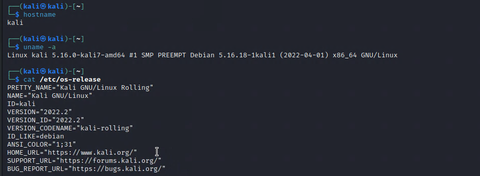
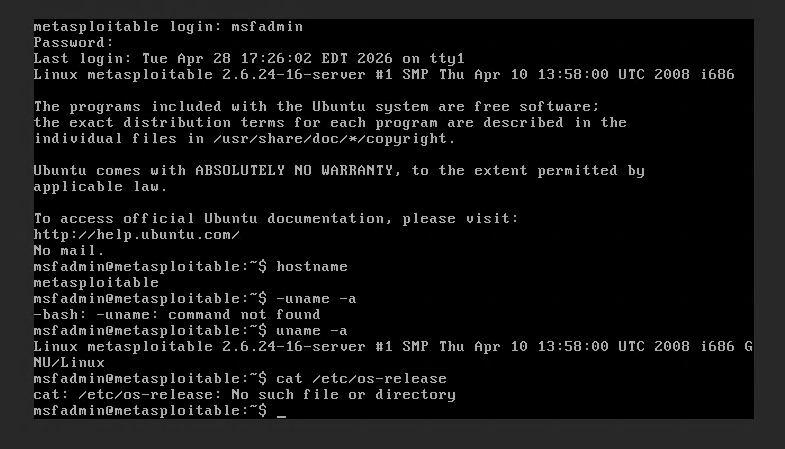
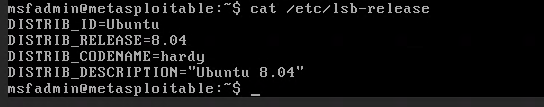
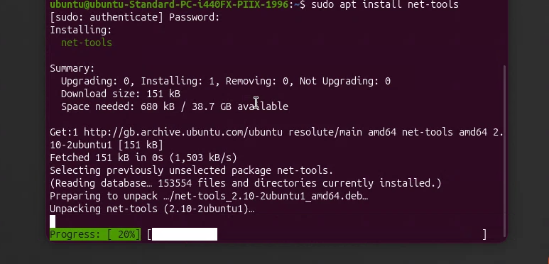
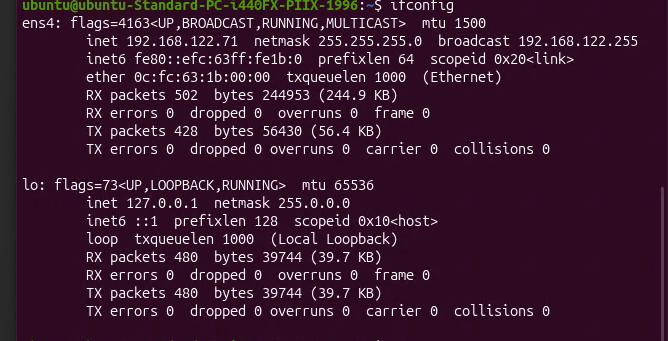
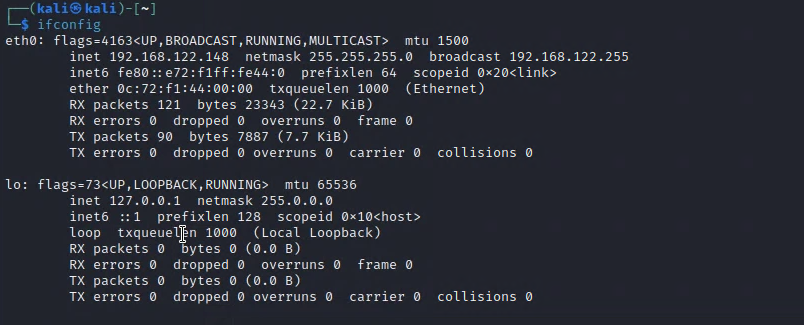
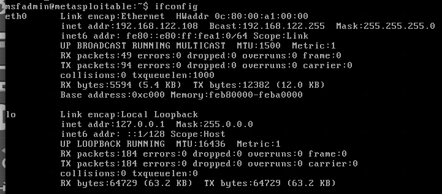
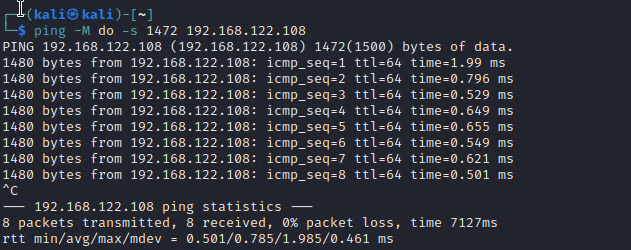
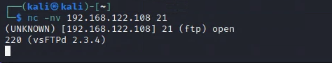

# Unit 3: Active Reconnaissance & Local Subnet Diagnostics

## Overview

This phase covers setting up local testing infrastructure, profiling sandboxed machines, and testing low-level link parameters.

---

## Exercise 3.1: Machine Baseline Profiling

To ensure testing environment compatibility, kernel releases and build structures were collected across active hosts using `hostname`, `uname -a`, and release scripts.

### Ubuntu Gateway Interface Profile

```bash
uname -a
```

**Results** - 
- **OS**: Ubuntu 26.04 LTS (Resolute Raccoon)
- **Kernel**: Linux 7.0.0-14 generic kernel structure
- **Verification**: Interface ens4 operational

### Local Attacker Platform (Kali Linux)

```bash
uname -a
```

**Results** - 
- **OS**: Rolling Kali Linux build
- **Base**: Debian 5.16.0 framework
- **Status**: Active penetration testing platform

### Legacy Threat Target (Metasploitable)

```bash
uname -a
```

**Results** - 
- **OS**: End-of-life Ubuntu 8.04 (Hardy)
- **Kernel**: Outdated 32-bit Linux 2.6.24-16 server structure
- **Note**: Running `cat /etc/os-release` returns an explicit error on legacy systems

### Bypass for Legacy Systems

```bash
cat /etc/lsb-release
```

**Results** - 
- Executing legacy path query successfully identifies OS despite system faults
- Confirms end-of-life Ubuntu 8.04 (Hardy) distribution

---

## Exercise 3.2: Subnet Interface Mapping Matrix

### Challenge: Modern System Deprecations

Modern system distributions deprecate `net-tools` configurations by default, causing standard `ifconfig` strings to return faults.

****
```bash
ifconfig
```
- System path shell error during interface query execution

### Dependency Resolution

****
```bash
sudo apt install net-tools
```
- Manually updating dependencies to restore network analysis components

****
```bash
ls /var/cache/apt/archives/
```
- Verify archive presence before re-running installation script

### Complete Lab Network Topology

**Network Segment**: `192.168.122.0/24` with netmask `255.255.255.0`

#### Ubuntu Gateway (Layer-3 Configuration)

****
```bash
ifconfig ens4
```
- **Interface**: ens4
- **IP Address**: 192.168.122.71
- **Role**: Default gateway for test segment

#### Kali Attacker Platform (Layer-3 Configuration)

****
```bash
ifconfig eth0
```
- **Interface**: eth0
- **IP Address**: 192.168.122.148
- **Role**: Penetration testing workstation

#### Metasploitable Target (Layer-3 Configuration)

****
```bash
ifconfig eth0
```
- **Interface**: eth0
- **IP Address**: 192.168.122.108
- **Role**: Vulnerable test target

### Network Topology Summary

```
┌─────────────────────────────────────────┐
│   192.168.122.0/24 Lab Network          │
├─────────────────────────────────────────┤
│ Gateway:        192.168.122.71 (Ubuntu) │
│ Attacker:       192.168.122.148 (Kali)  │
│ Target:         192.168.122.108 (Metaso)│
└─────────────────────────────────────────┘
```

---

## Exercise 3.3: Link MTU Sizing and Packet Fragmentation Verification

### Objective

Test physical link limitations and transport layer limits using ICMP payload limits.

### Test Command

```bash
ping -M do -s 1472 192.168.122.108
```

****

### Payload Calculation

| Component | Size |
|-----------|------|
| ICMP Payload | 1472 bytes |
| IP Header | 20 bytes |
| ICMP Header | 8 bytes |
| **Total Frame** | **1500 bytes** |

### Results

- **MTU Limit**: 1500-byte frame confirmed
- **Packet Loss**: 0% (no fragmentation required)
- **Interpretation**: Standard Ethernet MTU with no issues
- **Flag**: `-M do` enforces "Don't Fragment" bit for accurate testing

---

## Exercise 3.4: Port Scanning, Banner Grabbing & Active Interrogation

Active network scanning shifted focus from infrastructure parameters to service-layer vulnerabilities.

### Nmap Stealth SYN Port Sweep

```bash
sudo nmap -sS -Pn 192.168.122.108
```

****

**Results**:
- **Open Ports**: 23 discovered
- **Notable Services**:
  - Port 21: FTP
  - Port 23: Telnet
  - Port 1524: ingreslock
  - Port 6667: IRC
  - Port 5900: VNC

### Manual Socket Banner-Grabbing

```bash
nc -nv 192.168.122.108 21
```

****

**Technique**: Force clear-text application identification banners directly from raw socket connection

### Automated Version Signature Fingerprinting

```bash
sudo nmap -sV -p 21 192.168.122.108
```

****

**Results**:
- **Service**: vsftpd (Very Secure FTP Daemon)
- **Version**: 2.3.4
- **Vulnerability Status**: Known to contain supply-chain compromise backdoor

---

## Key Findings

✅ Legacy systems require alternative diagnostic commands  
✅ Interface enumeration reveals network topology  
✅ MTU testing validates link-layer parameters  
✅ Port scanning identifies service-layer targets  
✅ Version fingerprinting enables exploit selection  
✅ vsftpd 2.3.4 contains exploitable backdoor vulnerability

---

**[← Back: Unit 2](unit2.md)** | **[Home](index.md)** | **[Next: Unit 4 →](unit4.md)**
